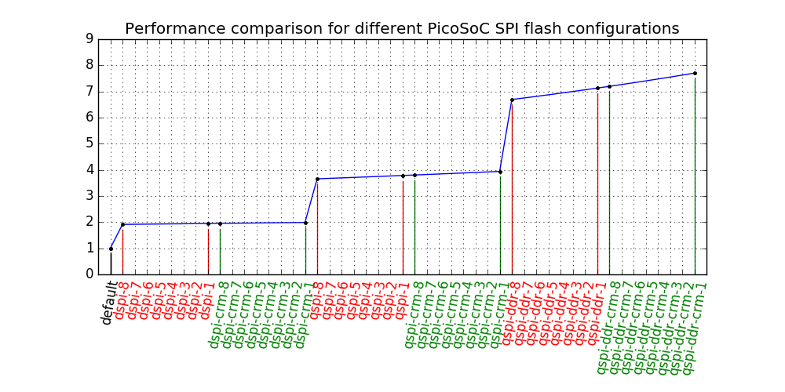

PicoSoC - A simple example SoC using PicoRV32
=============================================

This is a simple PicoRV32 example design that can run code directly from an SPI
flash chip. It can be used as a turn-key solution for simple control tasks in
ASIC and FPGA designs.

An example implementation targeting the Lattice iCE40-HX8K Breakout Board is
included.

The flash is mapped to the memory regions starting at 0x00000000 and
0x01000000, with the SRAM overlayed for the mapping at 0x00000000. The SRAM
is just a small scratchpad memory (default 256 words, i.e. 1 kB).

The reset vector is set to 0x00100000, i.e. at 1MB into in the flash memory.

See the included demo firmware and linker script for how to build a firmware
image for this system.

Run `make hx8ksim` or `make icebsim` to run the test bench (and create `testbench.vcd`).

Run `make hx8kprog` to build the configuration bit-stream and firmware images
and upload them to a connected iCE40-HX8K Breakout Board.

Run `make icebprog` to build the configuration bit-stream and firmware images
and upload them to a connected iCEBreaker Board.

| File                                | Description                                                     |
| ----------------------------------- | --------------------------------------------------------------- |
| [picosoc.v](picosoc.v)              | Top-level PicoSoC Verilog module                                |
| [spimemio.v](spimemio.v)            | Memory controller that interfaces to external SPI flash         |
| [simpleuart.v](simpleuart.v)        | Simple UART core connected directly to SoC TX/RX lines          |
| [start.s](start.s)                  | Assembler source for firmware.hex/firmware.bin                  |
| [firmware.c](firmware.c)            | C source for firmware.hex/firmware.bin                          |
| [sections.lds](sections.lds)        | Linker script for firmware.hex/firmware.bin                     |
| [hx8kdemo.v](hx8kdemo.v)            | FPGA-based example implementation on iCE40-HX8K Breakout Board  |
| [hx8kdemo.pcf](hx8kdemo.pcf)        | Pin constraints for implementation on iCE40-HX8K Breakout Board |
| [hx8kdemo\_tb.v](hx8kdemo_tb.v)     | Testbench for implementation on iCE40-HX8K Breakout Board       |
| [icebreaker.v](icebreaker.v)        | FPGA-based example implementation on iCEBreaker Board           |
| [icebreaker.pcf](icebreaker.pcf)    | Pin constraints for implementation on iCEBreaker Board          |
| [icebreaker\_tb.v](icebreaker_tb.v) | Testbench for implementation on iCEBreaker Board                |

### Memory map:

| Address Range            | Description                             |
| ------------------------ | --------------------------------------- |
| 0x00000000 .. 0x00FFFFFF | Internal SRAM                           |
| 0x01000000 .. 0x01FFFFFF | External Serial Flash                   |
| 0x02000000 .. 0x02000003 | SPI Flash Controller Config Register    |
| 0x02000004 .. 0x02000007 | UART Clock Divider Register             |
| 0x02000008 .. 0x0200000B | UART Send/Recv Data Register            |
| 0x03000000 .. 0xFFFFFFFF | Memory mapped user peripherals          |

Reading from the addresses in the internal SRAM region beyond the end of the
physical SRAM will read from the corresponding addresses in serial flash.

Reading from the UART Send/Recv Data Register will return the last received
byte, or -1 (all 32 bits set) when the receive buffer is empty.

The UART Clock Divider Register must be set to the system clock frequency
divided by the baud rate.

The example design (hx8kdemo.v) has the 8 LEDs on the iCE40-HX8K Breakout Board
mapped to the low byte of the 32 bit word at address 0x03000000.

### SPI Flash Controller Config Register:

| Bit(s) | Description                                               |
| -----: | --------------------------------------------------------- |
|     31 | MEMIO Enable (reset=1, set to 0 to bit bang SPI commands) |
|  30:23 | Reserved (read 0)                                         |
|     22 | DDR Enable bit (reset=0)                                  |
|     21 | QSPI Enable bit (reset=0)                                 |
|     20 | CRM Enable bit (reset=0)                                  |
|  19:16 | Read latency (dummy) cycles (reset=0)                     |
|  15:12 | Reserved (read 0)                                         |
|   11:8 | IO Output enable bits in bit bang mode                    |
|    7:6 | Reserved (read 0)                                         |
|      5 | Chip select (CS) line in bit bang mode                    |
|      4 | Serial clock line in bit bang mode                        |
|    3:0 | IO data bits in bit bang mode                             |

The following settings for CRM/DDR/QSPI modes are valid:

| CRM | QSPI | DDR | Read Command Byte     | Mode Byte |
| :-: | :--: | :-: | :-------------------- | :-------: |
|   0 |    0 |   0 | 03h Read              | N/A       |
|   0 |    0 |   1 | BBh Dual I/O Read     | FFh       |
|   1 |    0 |   1 | BBh Dual I/O Read     | A5h       |
|   0 |    1 |   0 | EBh Quad I/O Read     | FFh       |
|   1 |    1 |   0 | EBh Quad I/O Read     | A5h       |
|   0 |    1 |   1 | EDh DDR Quad I/O Read | FFh       |
|   1 |    1 |   1 | EDh DDR Quad I/O Read | A5h       |

The following plot visualizes the relative performance of the different configurations:

Consult the datasheet for your SPI flash to learn which configurations are supported
by the chip and what the maximum clock frequencies are for each configuration.

For Quad I/O mode the QUAD flag in CR1V must be set before enabling Quad I/O in the
SPI master. Either set it by writing the corresponding bit in CR1NV once, or by writing
it from your device firmware at every bootup. (See `set_flash_qspi_flag()` in
`firmware.c` for an example for the latter.)

Note that some changes to the Lattice iCE40-HX8K Breakout Board are required to support
the faster configurations: (1) The flash chip must be replaced with one that supports the
faster read commands and (2) the IO2 and IO3 pins on the flash chip must be connected to
the FPGA IO pins T9 and T8 (near the center of J3).

